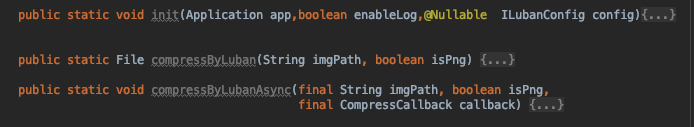
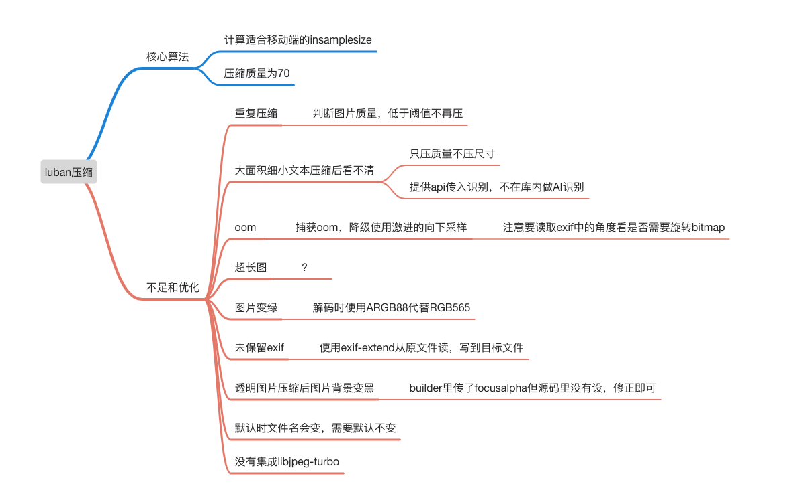

# Luban2

基于原Luban库,解决了原库存在的一些问题.增加了一些工程化实践的功能


# 功能特点

* 内部妥善处理OOM,直接拿去用,不用再加try-catch
* 完善处理图像旋转问题,杜绝异常情况导致的图像exif里oritation=0但实际显示角度不对的情况
* 优先使用双线性插值压缩,最大程度保证质量,尤其文本类图片质量
* 完美处理png压缩jpg过程中变黑问题,还可可自定义半透明处渲染的背景色
* 可指定输出格式:png,jpg.webp
* 有压缩前质量判断功能,不会发生重复压缩情况
* 支持指定输出图片质量.
* 支持指定输出图片最短边上限,比如1080, 720...
* 完善的日志系统


# 升级后:

## 使用

```
com.github.skyNet2017:Luban:1.2.5
```

Androidx版本:

```
com.github.skyNet2017:Luban:3.0.0
```

### LubanUtil

> 默认质量85. 不片面追求文件大小.
>
> 如果是聊天场景,可以自己设成65,最大可能节省大小.



### 方法列表

| 方法                | 描述                  |
| ------------------- | --------------------- |
| load                | 传入原图              |
| filter              | 设置开启压缩条件      |
| ignoreBy            | 不压缩的阈值，单位为K |
| setFocusAlpha       | 设置是否保留透明通道  |
| setTargetDir        | 缓存压缩图片路径      |
| setCompressListener | 压缩回调接口          |
| setRenameListener   | 压缩前重命名接口      |

### 异步调用

`Luban`内部采用`IO`线程进行图片压缩，外部调用只需设置好结果监听即可：

```java
Luban.with(this)
        .load(photos)
        .ignoreBy(100)
        .setTargetDir(getPath())
        .filter(new CompressionPredicate() {
          @Override
          public boolean apply(String path) {
            return !(TextUtils.isEmpty(path) || path.toLowerCase().endsWith(".gif"));
          }
        })
        .setCompressListener(new OnCompressListener() {
          @Override
          public void onStart() {
            // TODO 压缩开始前调用，可以在方法内启动 loading UI
          }

          @Override
          public void onSuccess(File file) {
            // TODO 压缩成功后调用，返回压缩后的图片文件
          }

          @Override
          public void onError(Throwable e) {
            // TODO 当压缩过程出现问题时调用
          }
        }).launch();
```

### 同步调用

同步方法请尽量避免在主线程调用以免阻塞主线程，下面以rxJava调用为例

```java
Flowable.just(photos)
    .observeOn(Schedulers.io())
    .map(new Function<List<String>, List<File>>() {
      @Override public List<File> apply(@NonNull List<String> list) throws Exception {
        // 同步方法直接返回压缩后的文件
        return Luban.with(MainActivity.this).load(list).get();
      }
    })
    .observeOn(AndroidSchedulers.mainThread())
    .subscribe();
```


### 有哪些优化




# 两种通用压缩策略/类型:

```java
public interface CompressType {

    /**
     * 给opencv,深度学习算法用的.
     * 可指定宽度上限. 比如720p, 1080p. 此分辨率对于算法已经足够大.
     * 尽量使用webp,且质量99
     * 如果一定要用jpg,质量设置为85.
     */
    int TYPE_FOR_ALG  = 1;

    /**
     * 用于人与人直接的交流.比如聊天图片,电商评价图片
     * 使用原生鲁班压缩倍数-近似微信. 也可以限定宽度上限,最大程度减小图片大小. 比如可统一限定到1080p
     * 质量使用65
     */
    int TYPE_FOR_CONMUNICATE  = 2;
}
```


# 重复压缩问题

质量判断-仅适用于jpg文件,采用量化表计算整张图片像素. 


# exif处理

```
默认: boolean keepExif = true;
```

使用自己写的库ExifUtil 读写exif:

比it.sephiroth.android.exif:library:1.0.1通用性好. 底层基于androidx.exifinterface:exifinterface.

```
api 'com.github.hss01248:metadata:1.0.1'
```

>  压缩前读exif,压缩后写exif:


# 旋转角度问题:

> 注意旋转成功/失败时不同的处理策略

```java
boolean rotateSuccess = false;
     
      //webp也有exif
      if (exifs != null ) {
        String ori = exifs.get("Orientation");
        if(TextUtils.isEmpty(ori)){
          try {
           int o =  Integer.parseInt(ori);
           if(o !=0){
             rotation = o;
             //可能oom. 万一oom了,图片还是留着,但是exif丽保留原旋转角度.
             tagBitmap = rotatingImage(tagBitmap, o);
             rotateSuccess = true;
           }
          }catch (Throwable throwable){
            throwable.printStackTrace();
          }
        }
      }
      bitmapToFile.compressToFile(tagBitmap,tagImg,focusAlpha,quality,luban,this);

      if(exifs != null ){
        if(luban.keepExif){
          //最后一个参数代表是否要复写Orientation参数为0. 旋转成功就复写,没有成功就维持原先的
          ExifUtil.resetImageWHToMap(exifs,tagImg.getAbsolutePath(),rotateSuccess);
          ExifUtil.writeExif(exifs,tagImg.getAbsolutePath());
        }else {
          if(!rotateSuccess && rotation != 0){
            //rotation回写:
            try {
              ExifInterface exif = new ExifInterface(tagImg);
              exif.setAttribute("Orientation",rotation+"");
              exif.saveAttributes();
            }catch (Throwable throwable){
              throwable.printStackTrace();
            }
          }
        }
      }
```


# 尺寸压缩时的损耗

> 尽量使用双线性插值代替默认的单线性插值

压缩插值算法效果对比见: https://cloud.tencent.com/developer/article/1006352

# OOM问题解决:

> 采用多次降级机制:

实现代码:

```java
//先使用双线性采样,oom了再使用单线性采样,还oom就强制压缩到720p
  private Bitmap compressBitmap() {

    float scale = 1f;
    if(luban.maxShortDimension != 0){
      //指定压缩上限:
      int shorter = Math.min(srcHeight,srcWidth);
      if(shorter > luban.maxShortDimension){
        scale = shorter * 1f / luban.maxShortDimension;
      }
    }else {
      //Luban.computeInSampleSize下限1080p
      scale = Luban.computeInSampleSize(srcWidth,srcHeight);
    }

    //获取原图的类型
    //String mimeType = options.outMimeType;
    //如果是png,看是否有透明的alpha通道,如果没有,给你压成jpg. 如果有,用白色填充.

    Bitmap tagBitmap2 = null;

    //计算个毛线,直接申请内存,oom了就降级:
    //压缩插值算法效果见: https://cloud.tencent.com/developer/article/1006352
    try {
      //使用双线性插值
      Bitmap tagBitmap = BitmapFactory.decodeFile(srcImg.getPath());
      tagBitmap2 = Bitmap.createScaledBitmap(tagBitmap,(int)(srcWidth/scale),(int)(srcHeight/scale),true);
    }catch (OutOfMemoryError throwable){
      throwable.printStackTrace();
      try {
        //使用单线性插值
        BitmapFactory.Options options = new BitmapFactory.Options();
        options.inSampleSize = (int) scale;
        //优先使用888. 因为RGB565在低版本手机上会变绿
        options.inPreferredConfig = Bitmap.Config.ARGB_8888;
        tagBitmap2 = BitmapFactory.decodeFile(srcImg.getPath(), options);
      }catch (OutOfMemoryError throwable1){
        throwable1.printStackTrace();

        //用RGB_565, 如果原图是png,且有透明的alpha通道,那么会变黑. 如何处理?
        try {
          //使用RGB565将就一下:
          BitmapFactory.Options options = new BitmapFactory.Options();
          options.inSampleSize = (int) scale;
          options.inPreferredConfig = Bitmap.Config.RGB_565;
          tagBitmap2 = BitmapFactory.decodeFile(srcImg.getPath(), options);
          isPngWithTransAlpha = false;
        }catch (OutOfMemoryError error){
          error.printStackTrace();
          //try {
            //还TMD不行,只能压一把狠的:强制压缩到720p:
            int w = Math.min(srcHeight,srcWidth);
            scale =  w/720f;
            BitmapFactory.Options options = new BitmapFactory.Options();
            options.inSampleSize = (int) scale;
            options.inPreferredConfig = Bitmap.Config.RGB_565;
            tagBitmap2 = BitmapFactory.decodeFile(srcImg.getPath(), options);
            isPngWithTransAlpha = false;
          //}catch (OutOfMemoryError error2){
          //  error2.printStackTrace();
            //还TMD不行,老子不压了,返回原图: 在外面处理:
         // }
        }
      }
    }
    return tagBitmap2;
  }
```


# png转jpg变黑问题解决:

> alpha通道值代表不透明度,而非透明度.  完全透明就是0.

### png透明度判断:


### 判断算法:

算法性能:

* 限定长边100时,最大耗时400ms
* 限定50时,最大耗时82ms
* 最快: 四个角判断是否为0,   1ms即可.


### 最终压缩前,再判断一次准备压缩的bitmap:

> 直接采四个角,中心点,次中心点,然后折半查找
>
> 大前提: 
>
>  "image/png/webp".equals(engine.originalMimeType)   && bitmap.getConfig().equals(Bitmap.Config.ARGB_8888)


```java
if("image/png".equals(engine.originalMimeType) || "image/webp".equals(engine.originalMimeType)){
            long start2 = System.currentTimeMillis();
            engine.isPngWithTransAlpha =   LubanUtil.hasTransInAlpha(tagBitmap);
            Log.d("ss","hastrans: cost(ms):"+(System.currentTimeMillis() - start2));
 }
```


```java
public static boolean hasTransInAlpha(Bitmap bitmap){
    if(!bitmap.getConfig().equals(Bitmap.Config.ARGB_8888)){
        return false;
    }
    int w = bitmap.getWidth()-1;
    int h = bitmap.getHeight()-1;
    if(isTrans(bitmap,0,0)
            || isTrans(bitmap,w,h)
            || isTrans(bitmap,0,h)
            || isTrans(bitmap,w,0)
            || isTrans(bitmap,bitmap.getWidth()/2,bitmap.getHeight()/2) ){
        //先判断4个顶点和中心.
        return true;
    }
    //然后折半查找
    return hasTransInAngel(bitmap,w,h);
}

private static boolean hasTransInAngel(Bitmap bitmap,int w, int h) {
    Log.d("ss","hastrans: porint:"+w+"-"+h);
    // int[][] arr = new int[8][2];
    if(w ==0 || h == 0){
        return false;
    }
    int halfw = w / 2;
    int halfh = h / 2;

    boolean hasTrans = isTrans(bitmap,w,h)
            || isTrans(bitmap,w,0)
            || isTrans(bitmap,0,h)
            || isTrans(bitmap,w,halfh)
            || isTrans(bitmap,halfw,h)
            || isTrans(bitmap,0,halfh)
            || isTrans(bitmap,halfw,0);
    if(hasTrans){
        return hasTrans;
    }
    return hasTransInAngel(bitmap,halfw,halfh) ;
}

private static boolean isTrans(Bitmap bitmap,int x,int y){
    int pix = bitmap.getPixel(x,y);
    int a = ((pix >> 24) & 0xff) ;
    return a != 255;
}
```


性能: 1200x1600的图片,跑完最长算法路径.耗时1ms


## 拿像素点,修改像素点

```java
 if(luban.targetFormat.equals(Bitmap.CompressFormat.JPEG)){
            if(engine.isPngWithTransAlpha){
                //原bitmap是imutable,不能直接更改像素点,要新建bitmap,像素编辑后设置
                Bitmap  bitmap = Bitmap.createBitmap(w,h, Bitmap.Config.ARGB_8888);

                long start = System.currentTimeMillis();
                out: for (int i = 0; i < w; i++) {
                    for (int j = 0; j < h; j++) {
                        // The argb {@link Color} at the specified coordinate
                        int pix = tagBitmap.getPixel(i,j);
                        int alpha = ((pix >> 24) & 0xff) ;/// 255.0f
                      if(alpha != 255 ){
                        
                        pix = trans(xxxxx)....//转换算法处
                          
                        bitmap.setPixel(i,j,pix);
                      }else{
                        bitmap.setPixel(i,j,pix);
                      }
                    }
               Log.d("luban","半透明通道颜色混合 cost(ms):"+(System.currentTimeMillis() - start));
                tagBitmap = bitmap;
                }
            }
 }
 }
                      
```

## 转换

Android原生默认的转换策略是直接将alpha != 255的像素点变成黑色: alpha=0. 转jpg时黑色化.. 效果不好. 

此处尝试两种转换策略:

### 策略1:  稍显野蛮粗暴

alpha=0 完全透明的点,使用背景色

alpha !=0的点,使用前景色.

```java
//策略1: 不混合颜色,只区分0和255.只要有半透明,就使用前景色  性能还可以
                            if(alpha == 0){
                                luban.tintBgColorIfHasTransInAlpha = luban.tintBgColorIfHasTransInAlpha | 0xff000000;
                                pix = luban.tintBgColorIfHasTransInAlpha ;
                                //也可以改成外部传入背景色
                            }else {
                               pix = pix | 0xff000000;
                            }
```

效果:

> 以下示例图中,activity背景色为洋红色, png图片压缩为jpg图时指定填充背景色也为洋红色,以与系统渲染对比效果.

半透明通道颜色混合 cost(ms):10


但在真正有半透明像素的图片上效果不好:

半透明通道颜色混合 cost(ms):574 


### 策略2: 严谨地使用alpha通道颜色混合计算方法来计算最终颜色:

>  显示颜色= 前景色* alpha/255 + 背景色 * (255 - alpha)/255
>
> 要使用rgb三个通道分别计算,而不能作为一个int值整体计算:

 ```java
                            if(alpha == 0){
                                //将alpha改成255.完全不透明
                                pix = luban.tintBgColorIfHasTransInAlpha | 0xff000000;
                            }else {
                               /* 要使用rgb三个通道分别计算,而不能作为一个int值整体计算:
                               long pix2 = (long) (pix * alpha/255f +  luban.tintBgColorIfHasTransInAlpha * (255f-alpha) / 255f);
                                pix2 = pix2 | 0xff000000; */

                                int r = ((pix >> 16) & 0xff);
                                int g = ((pix >>  8) & 0xff);
                                int b = ((pix      ) & 0xff);

                                int br = ((luban.tintBgColorIfHasTransInAlpha >> 16) & 0xff);
                                int bg = ((luban.tintBgColorIfHasTransInAlpha >>  8) & 0xff);
                                int bb = ((luban.tintBgColorIfHasTransInAlpha      ) & 0xff);

                                int fr = Math.round((r * alpha +  br * (255-alpha)) / 255f);
                                int fg = Math.round((g * alpha +  bg * (255-alpha)) / 255f);
                                int fb = Math.round((b * alpha +  bb * (255-alpha)) / 255f);

                                // 注意是用或,不是用加: pix = 0xff << 24 + fr << 16 + fg << 8 + fb;
                                pix =  (0xff << 24) | (fr << 16) | (fg << 8) | fb;
                                //等效: Color.argb(0xff,fr,fg,fb);
                            }
 ```

效果:

半透明通道颜色混合 cost(ms):951


半透明通道颜色混合 cost(ms):30


## 增加了一些trace,外部实现:

```
public void trace(long timeCost, int percent, long sizeAfterCompressInK, long width, long height) {
    LubanUtil.i("time cost(ms): "+timeCost+", filesize after compress:"+sizeAfterCompressInK +" , 压缩比:"+percent +"%,  wh:"+width+"-"+height);
}
```


# 完善的日志系统:


# 参考

[Android关于Color你所知道的和不知道的一切](https://cloud.tencent.com/developer/article/1370953)


# 原库:

# 项目描述

目前做`App`开发总绕不开图片这个元素。但是随着手机拍照分辨率的提升，图片的压缩成为一个很重要的问题。单纯对图片进行裁切，压缩已经有很多文章介绍。但是裁切成多少，压缩成多少却很难控制好，裁切过头图片太小，质量压缩过头则显示效果太差。

于是自然想到`App`巨头“微信”会是怎么处理，`Luban`（鲁班）就是通过在微信朋友圈发送近100张不同分辨率图片，对比原图与微信压缩后的图片逆向推算出来的压缩算法。

因为有其他语言也想要实现`Luban`，所以描述了一遍[算法步骤](/DESCRIPTION.md)。

因为是逆向推算，效果还没法跟微信一模一样，但是已经很接近微信朋友圈压缩后的效果，具体看以下对比！

# 效果与对比

内容 | 原图 | `Luban` | `Wechat`
---- | ---- | ------ | ------
截屏 720P |720*1280,390k|720*1280,87k|720*1280,56k
截屏 1080P|1080*1920,2.21M|1080*1920,104k|1080*1920,112k
拍照 13M(4:3)|3096*4128,3.12M|1548*2064,141k|1548*2064,147k
拍照 9.6M(16:9)|4128*2322,4.64M|1032*581,97k|1032*581,74k
滚动截屏|1080*6433,1.56M|1080*6433,351k|1080*6433,482k


### RELEASE NOTE

[Here](https://github.com/Curzibn/Luban/releases)

# License

    Copyright 2016 Zheng Zibin
    
    Licensed under the Apache License, Version 2.0 (the "License");
    you may not use this file except in compliance with the License.
    You may obtain a copy of the License at
    
        http://www.apache.org/licenses/LICENSE-2.0
    
    Unless required by applicable law or agreed to in writing, software
    distributed under the License is distributed on an "AS IS" BASIS,
    WITHOUT WARRANTIES OR CONDITIONS OF ANY KIND, either express or implied.
    See the License for the specific language governing permissions and
    limitations under the License.
